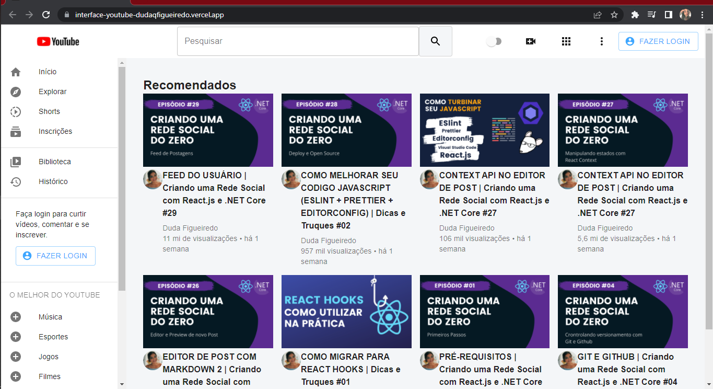
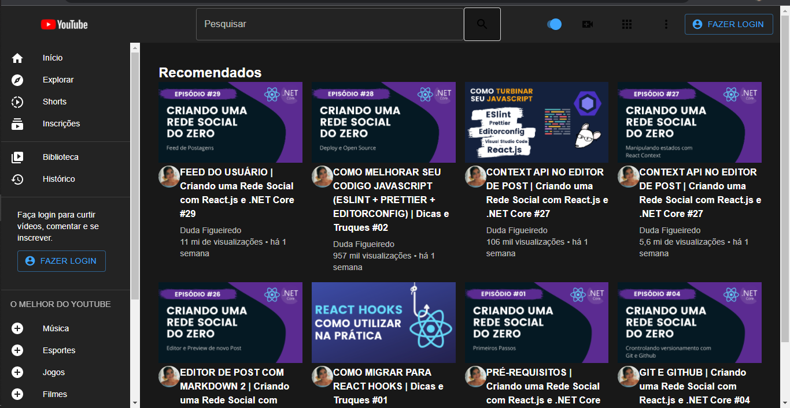
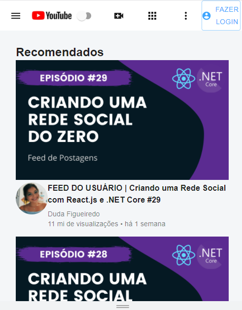

<h1 align="center"> Interface do Youtube </h1>

 

Esse projeto foi desenvolvido através de uma aula do Lucas Nhimi. O objetivo do projeto foi aprender a utilizar o Material UI.
Os componentes utilizados na página são do Material UI e a página é totalmente responsiva.

## 📁 Acesso ao projeto

**Indique como é possível baixar ou acessar o código fonte do projeto, seja projeto inicial ou final**

## 🛠️ Abrir e rodar o projeto

**Apresente as instruções necessárias para abrir e executar o projeto**
## Deploy do projeto
https://interface-youtube-dudaqfigueiredo.vercel.app/

## Imagens do projeto
### Interface Light

### Interface Dark

### Responsividade
